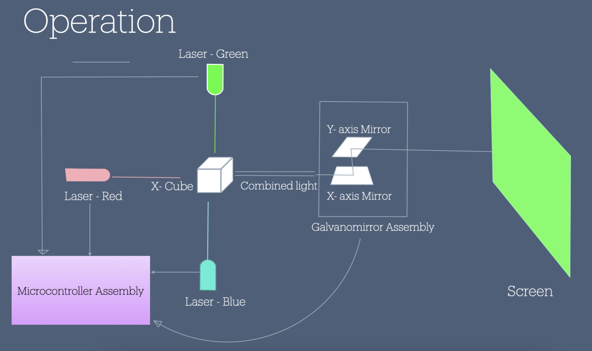
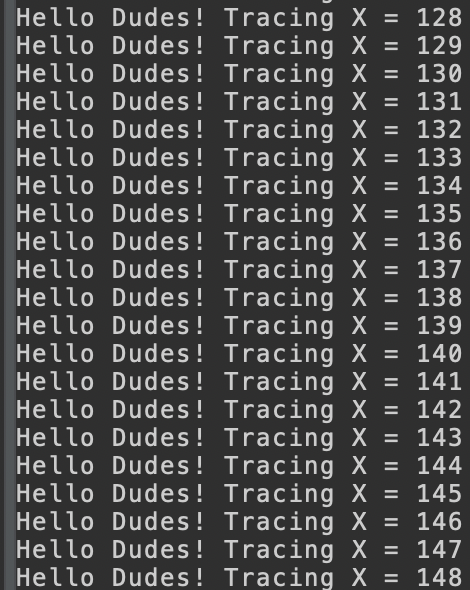
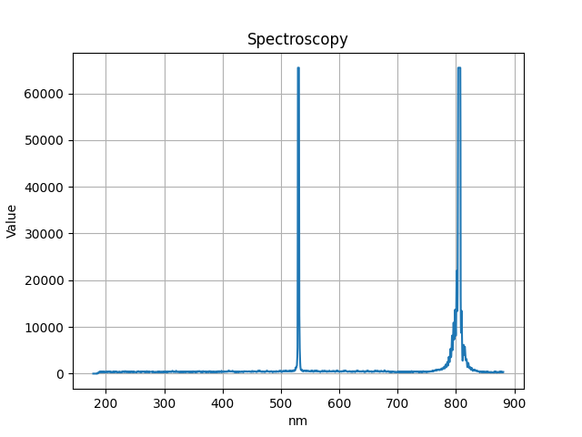
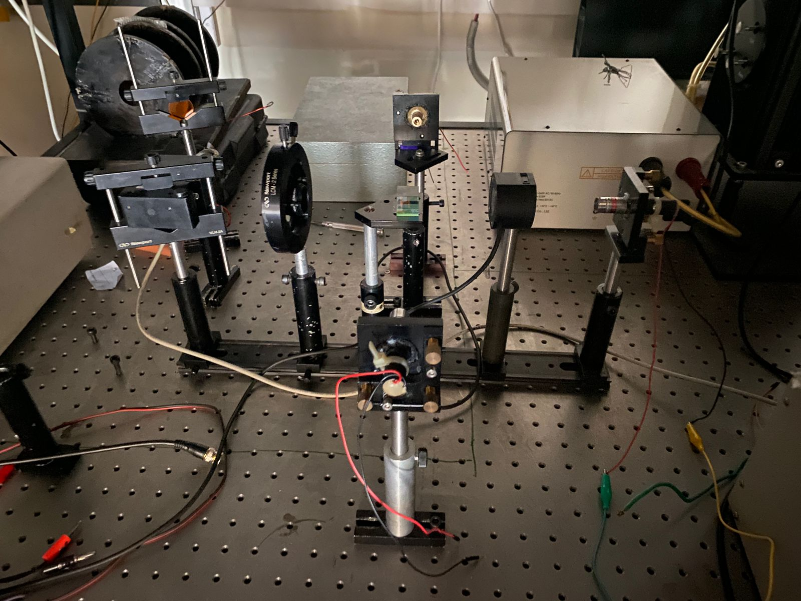

# Laser projector with 3 lasers (RGB) incident on an x-cube(dichroic) with galvanomirror
In an attempt to create multi colored beams of laser combined and then projected onto the screen with a galvanomirror and an stm32 microcontroller. This is the stm32 part where i'll be figuring out the firmware required to steer the combined resultant laser beam and changing colors as i please.

# NOTES STM Timer module 

Timer module in be in several different types 

1- timer mode 
TCNT register gets incremented by 1 after every clock cycle. the oscillating source goes through prescaler and then increments after every clock cycle. this mode can give an overflow interrupt when register is full. usually at 80Mhz and 1:1024 prescaler it's 0.89seconds. but if we want the interrupt to occure every 1 second.. we can use the preloader to not start the count from 0 but from some other value.

2- counter mode 
Instead of clock source can take any input and at rising or falling edge of signal the TCNT register increments by one. note that in this mode it also goes through the prescaler so we can set that to 1:1 to get real value

3- general timer module
all timer module consists of counter register, Auto-reload register with a preload register access and prescaler register.

# PWM Mode of timer module
In PWM mode, the timer module is clocked from an internal clock source and produces a digital waveform on the output channel pin called the PWM signal. By using output compare registers (OCR), the incrementing timer’s register value is constantly compared against this OCR register. When a match occurs the output pin state is flipped until the end of the period and the whole process is repeated.

The timer in PWM mode will produce a PWM signal at the specified frequency the user chose. The duty cycle is also programmatically controlled by its register. The PWM resolution is affected by the desired FPWM and other factors as we’ll see in the dedicated tutorials for PWM generation.

I'll be following "Discovering the STM32 Microcontroller" by 
Geoffrey Brown to get a better understanding of this controller.. too many concepts are flying right over my head as of right now. 

# Update Thu/27/June/2024 PWM working now
The pins are just outlets, the main work is done by the clock. I had to select a pin and see which timer it was attached to. these ones are all attached to timer 1 namely channel 1, 2, and 3. i enabled all of them one by one, chose the clock source as internal as the board i'm using does not have an external source. then selected following settings, note the prescaler and period value. that defined the frquency i'll get. the equation is something like (note you have to figure out which timer corresponds to which APB and use that speed instead of system clock incase its different.)

frquency = APB1 clock speed(not system) / ((Prescal + 1) * (period + 1))
in my case it was = 72 Mhz / (72*100) = 10 Khz
if want 1Khz signal then, only need to change Period. so equation becomes 

period +1 = APB1 clock / (frquency * (prescale +1))
so it should give me, 
period + 1 = 72 Mhz / (1Khz * (71+1)) 
period = 999 + 1 - 1 = 999

I chekced with an oscilloscope that it indeed was giving the desired freqency!

but i switched to stm32 to enjoy 16 bit PWM with possible values of 0-65573 yet i'm not sure if it generates the 1khz signal with 16 bit or not. let's find out. 

The formula with which to find resolution is as follows 

Resolution (R) = log(ARR (period) + 1)
so 
R = log(999 + 1)
R = 9.97, approximately 10 bits. which is still better than 8 bits
that
gave 256 possible values. but this will give 2^10 = 1024 discrete steps.. i wonder if there is a way to get to 16 bits while having the same frequency? my question is why would frequency of the signal matter while we are only looking at duty cycle? 

The pins were selected as: 

The settings of pwm channel was done as: 

# Serial debugging working Thu/27/June/2024 
I was thinking it might not be possible to get serial messages given that debugging was available. but to my surprise because of the presence of stlink programmer on board of F3-discovery board it gave me an access to virtual com port that was using the same com port as used by ide to program it. after enabling the UART1 in asynchronous mode i opened serial console within the ide and started the connection. 

# UPDATE Fri/28/June/2024 
Tested the pwm with a green laser with a transistor (2n222) in between it and the microcontroller. at 1Khz the laser was not turning. turned on at higher frequencies. tested with 10Khz it worked. so i guess my theory about the frequency not making a difference was wrong. i wonder if a mosfet will have a different behaviour? i'll try. 

Green Laser: 
The supply to the laser is set at 6V 400mA max
the laser at 100% duty cycle is taking 350mA max
The laser barely turns on at ARR = 13, but is steadily turned with a dim beam at ARR = 15 or 15% duty cycle. still need to figure the minimum value it will take to turn on and offset all my future pwm signal according to that. 

For further tests i need someway to control the pwm signal easily, right now i'm just uploading the program again and again with changed values. i think a potentiometer might work if i could map that to the ARR value. 

PS: though the laser is a common one and a weak one i feel my eyes straining when working near it..well ^_^ it seems like 6V @350mA is 2W and is not not not common. nevermind i found glasses and will wear it hereonforth. haha!

A question: Can i set only 0-100 value in CCR and that would correspond to duty cycle? no. CCR can be set 0 to value of ARR. incase of 1000 ARR it would range from 0-1000. CCR is basically used to control duty cycle. this value is compared with the ARR value to generate certain duty cycle (D). 

 D = \frac{CCR}{ARR + 1} \times 100\% 

 # UPDATE 3/JULY/2024 Did spectroscopy! 
 Since my project revolves around changing and understanding CIE coordinates of colors and converting those values to appropriate pwm signal for the lasers to result in a desired color, i had to find the exact wavelengths of lasers that i was using. for this i used a USB2000+ spectrometer from Oceanoptics. a spectrometer basically tells you where the incident light lies on the wavelength scale and what the intensity or sautration is. i first tested with green laser. It was being problematic at first and showing multiple peaks which made us conclude that the laser needs to be exactly pointing to the slit, a slight deviation would result in multiple peaks. but even after adjusting it a multiple times we couldn't get rid of an IR peak at around 800nm which shouldn't be there.. it wasn't there with other lights.. just with this laser. It seems that the peak needs not be clipped for an accurate measurement, instead it needs to be smooth with no sharp edges. this can be fixed by reducing the intensity of the laser. i put a kind of diffuser in between the path of light and reduced the duty cycle of the laser to a value of 30 to get good results. So i got the following result from data captured with the spectrometer. 

We can ignore the rest and focus on the fact that at 528.455nm it was showing the highest saturation. Checking that it indeed was giving the write results i searched and it is indeed. 

setting the usb2000+ inline with the beam was hard, the optical table did not have holes where i wanted them.. so i used a railing to put everything on it inline.. i then only had to change the vertical axis to bring it inline with the beam..

Next i have to find a way to generate PWM signal of the three lasers combined to result in a specific CIE coordinate. ofcourse i'll start with one color first. say different shades of green will have differen cie coordinates and that can be acheived with pwm duty cycle? i'm not sure gotta check. 

# Generating RGB Colors with lasers Mon/8/July/2024
I think the nearest possible application is of an rgb led and how it's able to generate a certain a color. Since i'm using a laser it will be a bit different but i think the conversion factor can be changed. I'll look into the construction of a laser.. how it's driven and find some papers that have attempted to control color of a laser. 

Side note: Just figured out why the IR wavelength was showing in the green laser. turns out the pure green lasers are rare and what we get is an IR laser lasing at 1056nm there about. The frequency is then double within the structure which halves the wavelength so we get around 532nm there about green light. 

The green laser is usually made of inGan material. but since my diode is an IR one not so sure what it's made of. Here's a proper true green laser. https://ams-osram.com/products/lasers/color-lasers-eel/osram-metal-can-to56-plt5-520b i found a good paper explaining the effects of PWM with this laser. i'll read it see if it will give me some insight into having proper pwm control with the laser.

Interesting facts gathered from this paper. 
- the current and output power shows almost a linear trend with green laser. but no so much with blue laser.. when i'm looking into blue laser i'll have to keep that in mind. 
- Higher temperature requires more current and outputs less power. 
- Power and duty cycle graph shows best possible results with highest power, lowest current, temperature controlled at 10khz at 30C. 

I haven't tried to control the laser with current yet. would i be able to? becuase the circuit inside the laser is a constant current (CC) driver. i should try atleast. and while i'm at it. i'll collect each lasers wavelength using spectrometer for CIE coordinates. i'll also measure each lasers optical power with change in voltage/pwm. 

I've found that most instruments have usbtcm connection which will let us talk to the device and gather data programatically. i'll try to set that up because when the new lasers arrive i have to be able to get the data fast. even right now i have to measure, wavelenght, voltage, current, pwm value, intensity and so on.. will be hard to get 1024 (10bit) data 

# Success with controlling instruments with python
Happy to share that i've made some promising progress towards accessing instruments supporting usb with python. I call the project "Instrument Orchestra", Instrument Orchestra is now hosted on GitHub with its own repository. https://github.com/manhoosbilli1/Instrument_Orchestra I've provided a detailed step by step installation guide for first experiment. 

I tried about 20 packages and different softwares to access this. thought why reinvent the wheel but none worked and almost no one was using this simple approach of accessing the instrument through serial. having some experience in electronics it was easy setting it up but installing the drivers were a pain. 

My setup is going to be a sweet one with me remotely getting data from the instrument. this will allow for long lasting testing sessions even when the lab is closed. only have to have my remote laptop attached to instruments and powered on. 

Next step would be integrating all 3 instruments with this software and creating a gui with it. i think a live graph of each instruments data would be nice.

# Minimizing no of instruments
Let's sit and think about the number of instruments i have to automate and the data that i actually need. 
- wavelength of light doesn't change with duty cycle. it should in theory just behave the same way but only the brightness should increase or decrease. so i can get away with manually getting the data of each individual laser light. 
- Optical power of laser light. i'm not sure how that would be useful in creating a relation between the color and laser input values but i should get it because thats the kind of data that will be varying. 
- Thanks to Dr. Faisal for pointing out to lookout for the minimum voltage where we will see the light but there will be no lasing. The way to recognize that is to look for a sharp step or a change of light in the laser as you are lowering the voltage. will need to note down that voltage value for all three lasers. and will have to mark that as offset. so will calculate the duty cycle range for each laser. say a laser will stop lasing at 30% then then will make sure that in the calculation it starts with that value. otherwise the calculations might produce a result which might not be taking effect in the real world. I wonder if normalising the duty cycle will help in the calculation? not sure how that will be.
- Need Voltage and current supplied by the PS but also will use the Sense pins on the PS to improve the data i'm getting. 
- PWM duty cycle, say after every increase of 1% it will report the value. this pwm cycle will be the trigger to query the data on other instruments. So say duty cycle increase from 35% to 36% then it will produce an interrupt on the python script running on windows. it will take 10 measurements of the power meter and then move to voltage and current from the power supply, take 10 measurements of that. i think thats all the measurements i need. will need to do this for the whole range of each laser. i will have to change the setup for each laser though because the setup is that way. 
For now will need to read up on some papers that have attempted to do the same because the reference part of the thesis looks empty right now. and i can't quote youtube videos or individual articles in it i suppose. 

# My setup

